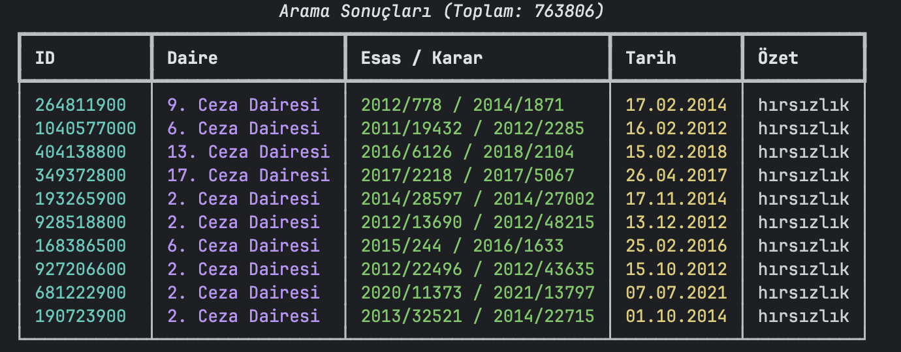
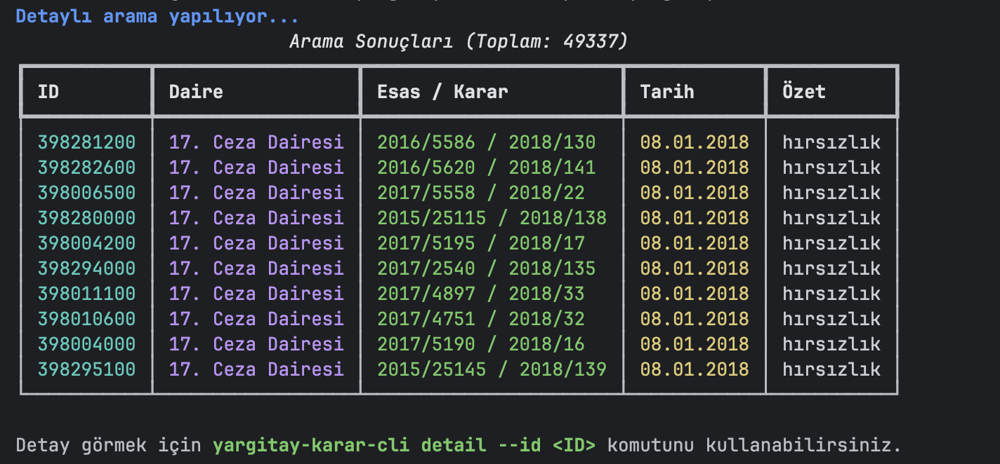
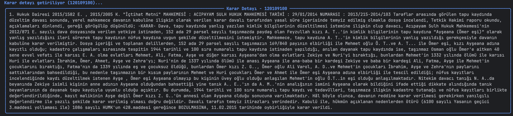

<p align="center">
  
</p>

<h1 align="center">Yargıtay Karar Arama Scraper & MCP Sunucusu</h1>

<p align="center">
  <a href="https://pypi.org/project/yargitay-karar-scraper/">
    
  </a>
  <a href="https://pypi.org/project/yargitay-karar-scraper/">
    
  </a>
  <a href="https://github.com/atacanyaymaci/yargitay-karar-scraper/actions">
    
  </a>
  <a href="LICENSE">
    
  </a>
</p>

<p align="center">
  <b>Yargıtay Karar Arama</b> sitesinden veri çeken, bunu bir komut satırı arayüzü (CLI) üzerinden renkli tablolarla sunan ve bir MCP (Model Context Protocol) sunucusu olarak Claude gibi Büyük Dil Modelleri (LLM) ile etkileşime açan modern ve modüler bir Python paketidir.
</p>

---

## ✨ Özellikler

- **Modüler Scraper:** `httpx` ve `pydantic` kullanılarak yazılmış temiz, nesne yönelimli ve tip güvenli asenkron (async) scraper çekirdeği.
- **Güçlü CLI:** `click` ve `rich` tabanlı, kullanıcı dostu ve interaktif görünüme sahip komut satırı arayüzü.
- **MCP Sunucusu:** LLM'lerin (Claude, Cursor vb.) otomatik olarak Yargıtay'da araştırma yapabilmesi için standart `mcp` arayüzü sağlayan sunucu.
- **Gelişmiş Arama:** Daire, esas yılı, karar yılı ve sıralama yönü gibi detaylı kriterlerle arama yapabilme yeteneği.
- **Karar Temizleme:** HTML etiketleriyle dolu kararları otomatik olarak temizleyip saf ve okunaklı metin haline dönüştürme.

---

## 📸 Ekran Görüntüleri (CLI)

<details open>
  <summary><b>Terminal Arayüzü Ekran Görüntüleri (Görmek için tıklayın)</b></summary>
  <br>
  
  <table>
    <tr>
      <td align="center">
        <b>Basit Arama</b><br>
        
      </td>
      <td align="center">
        <b>Detaylı Arama</b><br>
        
      </td>
    </tr>
    <tr>
      <td colspan="2" align="center">
        <b>Karar Detayı Okuma</b><br>
        
      </td>
    </tr>
  </table>
</details>

---

## 🚀 Kurulum

PyPI üzerinden kararlı sürümü kurmak için (yakında):

```bash
pip install yargitay-karar-scraper
```

Kaynak koddan kurmak ve geliştirmek için:

```bash
git clone https://github.com/atacanyaymaci/yargitay-karar-scraper.git
cd yargitay-karar-scraper
pip install -e .
```

---

## 💻 Kullanım

### 1. Komut Satırı Arayüzü (CLI)

CLI aracını `yargitay-karar-cli` komutu ile terminalden doğrudan kullanabilirsiniz.

**Basit Arama:**
```bash
yargitay-karar-cli search --kelime "hırsızlık" --page-size 10
```

**Gelişmiş / Detaylı Arama:**
```bash
yargitay-karar-cli detailed-search --kelime "hırsızlık" --daire "1. Ceza Dairesi" --karar-yil "2018"
```

**Bir Kararın Tam Metnini Çekmek:**
```bash
yargitay-karar-cli detail --id "120109100"
```

*Daha fazla detay için `docs/cli_usage.md` dosyasına göz atabilirsiniz.*

### 2. MCP Sunucusu Olarak Kullanım

Aşağıdaki komut MCP sunucusunu (stdio üzerinden) ayağa kaldırır ve LLM'lerin `search_cases` ile `get_case_detail` araçlarını kullanabilmesini sağlar:

```bash
yargitay-karar-mcp
```

Bunu **Claude Desktop** uygulamanızın `claude_desktop_config.json` dosyasına şu şekilde ekleyebilirsiniz:

```json
{
  "mcpServers": {
    "yargitay_kararlar": {
      "command": "yargitay-karar-mcp",
      "args": []
    }
  }
}
```

Kurulumu yaptıktan sonra Claude'a doğrudan şu şekilde promptlar verebilirsiniz:
> *"Bana Yargıtay 1. Ceza Dairesinin 2018 yılında vermiş olduğu 'kasten adam öldürme' ile ilgili kararları bulur musun?"*

*Daha fazla detay ve kullanım senaryosu için `docs/mcp_usage.md` dosyasına göz atabilirsiniz.*

### 3. Python Kütüphanesi Olarak Kullanım

Eğer kendi Python projenizde doğrudan kod üzerinden kullanmak isterseniz, paketimizin asenkron (async) `YargitayClient` sınıfını kolayca projenize dahil edebilirsiniz:

```python
import asyncio
from yargitay_karar_scraper.scraper import YargitayClient, SearchCriteria

async def main():
    client = YargitayClient()
    criteria = SearchCriteria(kelime="dolandırıcılık", page_size=5)
    
    response = await client.search(criteria)
    
    if not response.error:
        for case in response.results:
            print(f"Karar ID: {case.id} | Esas/Karar: {case.esas_no} / {case.karar_no}")

if __name__ == "__main__":
    asyncio.run(main())
```

*Kendi projenize entegre etmeden önce daha fazla detaylı kod örneği incelemek için projedeki `examples/` klasörüne göz atabilirsiniz.*

---

## 📄 Lisans

Bu proje [MIT Lisansı](LICENSE) altında lisanslanmıştır. Dilediğiniz gibi kullanabilir, değiştirebilir ve dağıtabilirsiniz.
